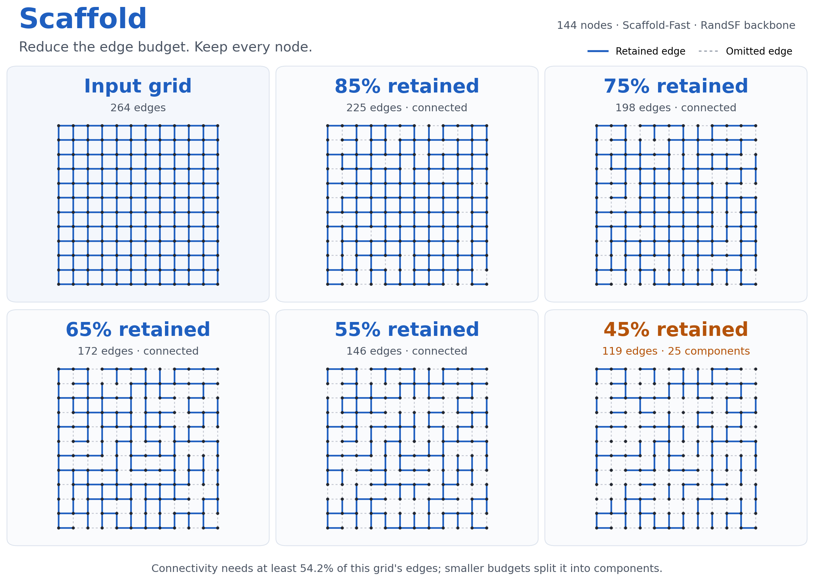
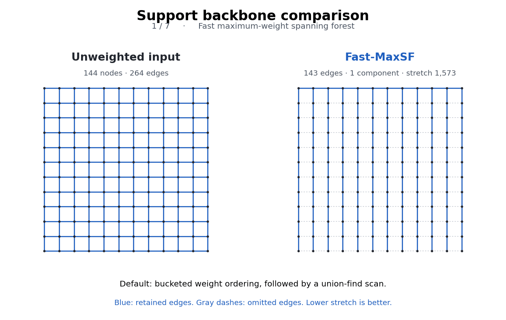
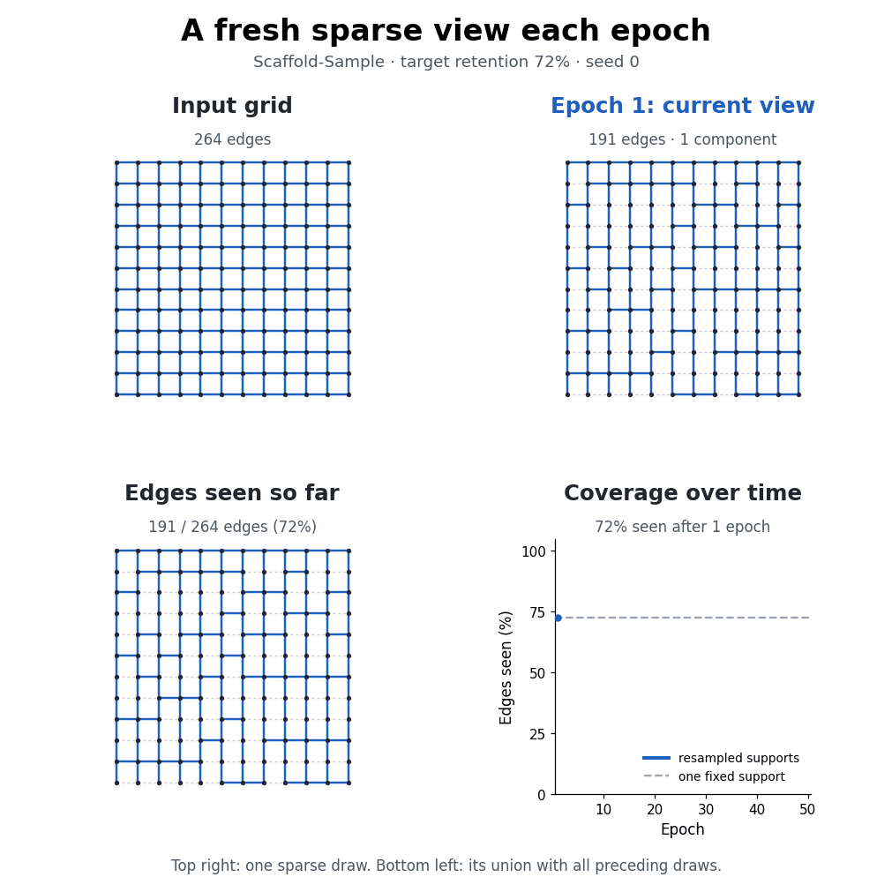

# Scaffold

**Reduce the edge budget. Keep every node.**



Scaffold-Fast with a seeded random spanning forest (RandSF) backbone. Blue edges
are retained; gray dashes are omitted. The 45% view illustrates a budget below
this grid's connectivity floor; all 144 nodes remain.

Scaffold is a **dilation- and congestion-aware graph sparsification** package.
It builds a sparse graph in two stages: choose a **support backbone**
(a spanning forest), then add edges whose missing connections require long or
congested detours. Each output meets the requested edge budget and preserves
the input's connected components whenever that budget can hold the backbone.

**Spanning forests:** each backbone contains one tree per input connected
component, with isolated vertices preserved. We use forest names such as
**RandSF**, **MaxSF**, and **MinSF**; a connected input is the special case
where the forest is a single tree.

The core uses NumPy and SciPy. Inputs can be NetworkX graphs, PyTorch Geometric
`Data`, SciPy sparse matrices, or `(2, m)` edge-index arrays.

## Measured runtimes

Paper measurements at **20% edge retention, 8 CPU workers** on synthetic
unweighted graphs. Edge counts are unique undirected edges.

| Variant | Nodes | Edges | Measured time |
|---|---:|---:|---:|
| Greedy | 400 | 3,131 | **0.75 s** |
| Heap (product score) | 4,000 | 39,893 | **28.65 s** |
| Batch | 10,000 | 250,000 | **32.64 s** |
| Fast | 200,000 | 2,399,834 | **0.73 s** |
| Sample (8 scoring backbones) | 200,000 | 2,399,834 | **5.01 s** preprocessing + **0.048 s** per cached draw |

These are warmed-kernel medians on a shared AMD EPYC 7282 host. Construction
includes the backbone and output assembly; input loading, normalization, JIT
startup, and GNN training are excluded. Batch uses 512 candidates / 64
insertions per cluster, with ten clusters. The graph sizes differ: Batch on
the 200K-node graph took **57.4 minutes** with a larger insertion batch
(256 per cluster).
[Full settings, measurements, and scaling guidance](docs/performance.md).

[Installation](#installation) · [Quick start](#quick-start) ·
[Usage](#standalone-usage) · [Algorithms](#the-five-algorithms) ·
[Backbones](#support-backbones) · [Connectivity](#the-connectivity-floor) ·
[Tuning](#tuning-the-objective) · [PyG](#pytorch-geometric) ·
[Parallelism](#parallelism) · [Runtime](#runtime-expectations) · [Visual demos](#visual-demos) ·
[Documentation](#documentation)

---

## Installation

During private testing, install from the private GitHub repository:

```bash
pip install "scaffold-sparse @ git+ssh://git@github.com/siddhartha047/Scaffold.git"

# Recommended for compiled kernels on medium/large graphs:
pip install "scaffold-sparse[speed] @ git+ssh://git@github.com/siddhartha047/Scaffold.git"
```

After the public PyPI release, the shorter commands below become available.

```bash
pip install scaffold-sparse              # core: numpy + scipy
pip install "scaffold-sparse[speed]"     # + numba (10-50x on large graphs)
pip install "scaffold-sparse[networkx]"  # + networkx
pip install "scaffold-sparse[pyg]"       # + torch, torch-geometric
pip install "scaffold-sparse[viz]"       # + matplotlib, for the demos
pip install "scaffold-sparse[all]"       # everything except torch
```

Requires Python 3.9+. The distribution is `scaffold-sparse`; the canonical
import name is `scaffold` (`import scaffold_sparse` is also supported).

> **numba is optional but strongly recommended.** Without it the union-find,
> LCA and prefix-sum kernels fall back to pure Python loops — correct, but only
> fast enough for small graphs. Initial calls can take longer while compiled
> kernels initialize; the measurements above exclude that startup cost.

---

## Quick start

```python
import scaffold

G = scaffold.grid_graph(12, 12)  # 144 nodes, 264 undirected edges
result = scaffold.fast(G, keep_ratio=0.6, seed=0)
print(result.summary())

A_sparse = result.to_scipy()
# Also available: .to_networkx(), .to_pyg(), .to_torch()
```

`keep_ratio=0.6` retains `ceil(0.6 * m)` undirected edges. Use `num_edges=`
instead for an explicit budget. Fast uses `fast-maxsf` as its default backbone;
pass `backbone="randsf"` for a seeded random spanning forest. The visual demos
below use RandSF for the algorithm, budget, and sampling comparisons.

---

## Standalone usage

This example uses NetworkX (`pip install "scaffold-sparse[networkx]"`).
The core API also accepts SciPy matrices and NumPy edge-index arrays.

```python
import networkx as nx
import scaffold

G = nx.karate_club_graph()
result = scaffold.fast(G, keep_ratio=0.5, seed=0)

# Original sampled-batch growth instead of one-pass Fast:
batch_result = scaffold.batch(
    G, keep_ratio=0.5, sample_size=64, add_per_round=8, seed=0
)

H = result.to_networkx()          # original node labels preserved
print(nx.is_connected(H))         # True

result.mask                       # bool array over G's canonical edges
result.edge_ids                   # indices of the kept edges
result.edge_index                 # (2, 2k) symmetric numpy array
result.metadata                   # runtime, backbone, delta_min, ...
```

Choose either a ratio (with either spelling) or an explicit edge count:

```python
scaffold.fast(G, keep_ratio=0.1)      # ceil(0.1 * m) edges
scaffold.fast(G, target_ratio=0.1)    # equivalent research-config spelling
scaffold.fast(G, num_edges=40)       # exactly 40 of this graph's 78 edges
```

SciPy and raw arrays work the same way:

```python
import numpy as np
import scipy.sparse as sp

A = sp.load_npz("adjacency.npz")
A_sparse = scaffold.fast(A, keep_ratio=0.2).to_scipy()

edge_index = np.load("edges.npy")             # (2, m)
result = scaffold.fast(edge_index, keep_ratio=0.2)
```

Full walkthrough: [`examples/02_standalone.py`](https://github.com/siddhartha047/Scaffold/blob/main/examples/02_standalone.py).

---

## The five algorithms

All variants share the backbone and dilation/congestion score; they differ
in how often they evaluate candidates and which edges they retain.

| Method | How it selects edges | Intended scale |
|---|---|---|
| `scaffold.greedy` | Recompute all candidate scores after every insertion. | Small graphs; reference construction. |
| `scaffold.heap` | Cache scores and selectively refresh affected candidates. | Small graphs; reduce repeated work. |
| `scaffold.batch` | Score sampled candidate batches and insert their top edges. | Medium/large graphs; refresh scores during growth. |
| **`scaffold.fast`** | **Score once on the initial forest, then select the highest-ranked candidates.** | **Medium/large graphs; default method.** |
| `scaffold.sample` | Aggregate backbone scores into weights for repeated sparse draws. | Medium/large graphs; resampling during GNN training. |

Greedy, Heap, Batch, and Fast return a sparse-graph result. Sample returns
sampling weights; call `.draw(keep_ratio=..., seed=...)` to obtain a support.
See the [algorithm guide](docs/algorithms.md) for complexity bounds and measurements.

Batch chooses its sizes automatically: **64 candidates / 8 insertions** below
1,024 input edges, and **256 / 64** on larger inputs. Larger insertion batches
reduce construction time but can change support quality. Set
`sample_size=64, add_per_round=8` to reproduce the previous behavior.
For scalable single-pass construction, use Fast; for repeated draws, precompute
Sample once and reuse `.draw()`. Install the `speed` extra for compiled kernels.
Check the [runtime expectations](#runtime-expectations) before a large Batch
run: its repeated searches cover the growing support even when candidates
are partitioned into clusters.

<details>
<summary>Batch construction cost</summary>

For the Batch bound, `s = sample_size`, `r = add_per_round`, `A` is the
number of edges added after the backbone, and `h` is the number of edges in
the current support graph (`h <= m`). Assuming a full batch contributes `r`
edges, Batch evaluates about `ceil(A/r)` batches. Each unweighted batch scans
its candidate pool in `O(m)`, runs at most `s` BFS searches in `O(s(n+h))`,
and ranks the sample in `O(s log s)`. Thus the simpler worst-case bound is
`O(ceil(A/r) s(n+m))`. For weighted paths, replace the BFS term with
`O(s(n+h) log n)` for Dijkstra. Candidates sharing a source reuse one search,
so the observed cost can be lower.

</details>

```python
result = scaffold.greedy(G, keep_ratio=0.2)
result = scaffold.heap(G,   keep_ratio=0.2)
result = scaffold.batch(G,  keep_ratio=0.2)
result = scaffold.fast(G,   keep_ratio=0.2)
scores = scaffold.sample(G)
result = scores.draw(keep_ratio=0.2, seed=0)

# or by name
result = scaffold.sparsify(G, method="fast", keep_ratio=0.2)
```

<details>
<summary>How Fast scores paths efficiently, and its trade-offs</summary>

While the support graph is still the backbone forest, every term of the
objective is a path aggregate on a *tree* — and every path aggregate on a tree
is a difference of two root-prefix sums. So instead of one shortest-path search
per candidate edge, the entire candidate set is scored together:

1. root the forest, build a binary-lifting ancestor table;
2. LCA of every candidate's endpoints;
3. edge and node congestion for **all** paths at once (+1 at both endpoints,
   −2 at the LCA, fold subtrees upward);
4. root-prefix sums, making every path aggregate an `O(1)` difference.

The scores are *identical* to what `scaffold.greedy` computes in its first round.
That equivalence is enforced by the test suite, not asserted in prose — see
[`tests/test_scoring.py`](https://github.com/siddhartha047/Scaffold/blob/main/tests/test_scoring.py).

Because the score is static during growth, the whole selection reduces to one
top-k.

The trade that buys: on a random geometric graph (600 nodes, 2,932 edges),
`greedy` takes 9,235 ms and `fast` 0.8 ms — 11,000× — for a mean dilation of
2.68 against Greedy's 2.40. Where `fast` does pay is *congestion*: a static
score cannot see the edges already added, so it concentrates its picks.
`scaffold.batch` and `scaffold.sample` spread them out.
[`docs/algorithms.md`](https://github.com/siddhartha047/Scaffold/blob/main/docs/algorithms.md) has the measured numbers across four
graph families, including the case where `fast` looks bad.

</details>

---

## Support backbones

The backbone is the spanning forest SCAFFOLD grows from, and it is what makes
the connectivity guarantee possible.

The names below also label the [backbone figures](#choose-a-support-backbone).
**All built-in backbone constructions except `none` compute a spanning
forest**. For `n` nodes and
`c` input components, the full backbone contains `n − c` edges and one tree
per component; an isolated vertex is a one-node tree. No edges are invented
between disconnected components. The **final sparse support can contain
cycles** because Scaffold adds edges to this initial forest.

The display names use **SF** for spanning forest, **SPF** for shortest-path
forest, **GLSF** for greedy low-stretch forest, and **LLSF** for local-search
low-stretch forest. Python accepts the forest spellings (`randsf`, `maxsf`,
`minsf`, `spf`, `glsf`, `llsf`) and their historical tree spellings as exact
synonyms. Case and hyphen/underscore differences are accepted too.
Use `backbone="SF"` or `backbone="MaxSF"` for the deterministic maximum-weight
forest, and `backbone="LLSF"` for local search. Old names such as `maxst`,
`randst`, `mst`, and `llst` remain supported without changing their behavior.
Metadata and saved artifacts keep their historical keys for compatibility.
See the [complete alias tables](docs/backbones.md#forest-aliases), including
Sample's `fixed-maxsf`, `fixed-slsf`, and `rotate-randsf` modes.

| API name | Full name | How it builds the backbone |
|---|---|---|
| **`fast-maxsf`** | **Fast maximum-weight spanning forest (Fast-MaxSF)** | **Default.** Approximate weight ordering with buckets, followed by Kruskal. |
| `fast-minsf` | Fast minimum-weight spanning forest (Fast-MinSF) | Bucketed Kruskal favoring smaller weights. |
| `maxsf` | Maximum-weight spanning forest (MaxSF) | Exact Kruskal, favoring larger weights. |
| `minsf` | Minimum-weight spanning forest (MinSF) | Exact Kruskal, favoring smaller weights. |
| `fast-randsf` | Fast randomized spanning forest (Fast-RandSF) | Seeded strided edge scan, without a full permutation array. |
| `randsf` | Random spanning forest (RandSF) | Kruskal over a seeded random edge permutation. |
| `spf` | Shortest-path forest (SPF) | Breadth-first forest from degree-selected roots; uses hop distance. |
| `randspf` | Random shortest-path forest (RandSPF) | Seeded random roots and traversal/tie ordering; BFS or weighted Dijkstra. Requires NetworkX. |
| `slsf` | Scalable low-stretch forest (SLSF) | Multi-root BFS/Dijkstra heuristic, selecting by estimated mean stretch. Requires NetworkX. |
| `glsf` | Greedy low-stretch forest (GLSF) | Greedily grows a forest using projected stretch and cut size; small graphs only. |
| `llsf` | Local-search low-stretch forest (LLSF) | Refines an initial forest through improving cycle-edge swaps; small graphs only. |
| `none` | No backbone | Select edges without the backbone connectivity guarantee. |

The randomized Kruskal backbones randomize edge order; they are not uniform spanning-tree
samplers. On unweighted inputs, the minimum- and maximum-weight variants
coincide under the implementation's tie ordering.

```python
scaffold.available_backbones(notation="forest")  # preferred SF names
scaffold.fast(G, keep_ratio=0.2, backbone="SF", seed=0)  # same as MaxSF / maxst
scaffold.fast(G, keep_ratio=0.2, backbone="fast-randsf", seed=0)
scaffold.fast(G, keep_ratio=0.2, backbone=my_precomputed_mask)

scaffold.register_backbone("mine", my_builder)   # plug in your own
```

See [`docs/backbones.md`](https://github.com/siddhartha047/Scaffold/blob/main/docs/backbones.md) and
[`examples/04_backbones_and_tuning.py`](https://github.com/siddhartha047/Scaffold/blob/main/examples/04_backbones_and_tuning.py).

### Local-search backbone (LLSF)

For small graphs, the local-search low-stretch forest is available as
`backbone="llsf"` (requires `pip install "scaffold-sparse[networkx]"`). It
refines an initial spanning forest through improving cycle-edge swaps within
each component before Scaffold adds the remaining budget:

```python
result = scaffold.fast(
    G, keep_ratio=0.7, backbone="llsf", seed=0,
    backbone_options={"init_support": "maxsf", "max_passes": 5},
)
```

Greedy, Heap and Batch accept the same backbone options. See
[`docs/backbones.md`](docs/backbones.md#llst) for the exact and sampled LLSF
settings, and [`examples/05_local_search_backbone.py`](examples/05_local_search_backbone.py)
for a standalone forest example.

**LLSF rejects inputs above 1,000 undirected edges by default.** The limit
counts the full input, even when the requested output budget is small.
Exhaustive cycle-swap search can take many
minutes; the threshold is not a speed guarantee for smaller inputs. Deliberate
experiments can raise it with `backbone_options={"max_input_edges": 2000}`;
the backbone guide shows how to combine this with sampled search.

---

## The connectivity floor

A spanning forest of a graph with `n` nodes and `c` components has `n − c`
edges. Below `delta_min = (n − c) / m`, **no** sparsifier of any kind can keep
the components intact. SCAFFOLD does not pretend otherwise:

```python
result = scaffold.fast(G, keep_ratio=0.05)
result.metadata["delta_min"]                   # minimum ratio for connectivity
result.metadata["below_connectivity_floor"]    # True
result.num_components()                        # > 1, necessarily
```

In that below-floor case, all five variants first construct their complete
support forest and then randomly drop forest edges until the exact requested
budget is reached. Pass `seed=` to make that trim reproducible. This avoids
favoring the prefix of a backbone's deterministic edge order. Each
`sample.draw()` re-trims the forest, so per-epoch views still change.

Above the floor, every variant — including every `sample` draw — returns
exactly the input's component count. Not in expectation; with probability 1.

---

## Tuning the objective

```python
scaffold.fast(G, keep_ratio=0.2,
              alpha=1.0,        # dilation exponent
              beta_edge=1.0,    # edge-congestion exponent
              beta_node=1.0,    # node-congestion exponent
              edge_norm_p=2.0,  # p-norm along the path's edges
              node_norm_q=2.0)  # q-norm along the path's interior nodes
```

`score(e) = (dil/D_max)^alpha · (eConPath/E_max)^beta_edge · (vConPath/V_max)^beta_node`

`alpha` rewards candidates with a long detour; the betas reward candidates whose
detour runs through an already-overloaded part of the support, on the grounds
that adding them relieves a bottleneck. Setting both betas to `0` disables the
congestion terms and is noticeably faster.

Details in [`docs/algorithms.md`](https://github.com/siddhartha047/Scaffold/blob/main/docs/algorithms.md).

---

## PyTorch Geometric

```bash
pip install "scaffold-sparse[pyg]"
```

```python
from torch_geometric.datasets import Planetoid
import scaffold

data = Planetoid(root="/tmp/Cora", name="Cora")[0]

result = scaffold.fast(data, keep_ratio=0.6, seed=0)
sparse = result.to_pyg()          # x, y, train/val/test masks all preserved

print(data.num_edges, "->", sparse.num_edges)
```

As a dataset transform:

```python
from scaffold.pyg import ScaffoldTransform

dataset = Planetoid(
    root="/tmp/Cora", name="Cora",
    transform=ScaffoldTransform(method="fast", keep_ratio=0.6),
)
```

The same transform accepts Batch without any adapter changes:

```python
ScaffoldTransform(
    method="batch",
    keep_ratio=0.6,
    seed=0,
    sample_size=64,
    add_per_round=8,
)
```

Per-epoch resparsification — one precompute, a fresh view each epoch:

```python
from scaffold.pyg import ScaffoldResampler

resampler = ScaffoldResampler(data, keep_ratio=0.6, seed=0,
                              backbone="rotate-randsf")

for epoch in range(500):
    view = resampler.epoch(epoch)      # a new Data, exact budget, exact components
    out = model(view.x, view.edge_index)
    ...
```

Or take the weights directly:

```python
scores = scaffold.sample(data, seed=0)
data.edge_index, data.edge_weight = scores.to_torch()
```

Full walkthrough with a trained GCN:
[`examples/03_pytorch_geometric.py`](https://github.com/siddhartha047/Scaffold/blob/main/examples/03_pytorch_geometric.py).

---

## Parallelism

Every variant takes a `workers` argument. It is a pure speed knob: the selected
edges are **bit-for-bit identical at any worker count**, so you can tune it
without invalidating a comparison.

```python
scaffold.fast(G, keep_ratio=0.2)              # auto: min(8, cpus)
scaffold.fast(G, keep_ratio=0.2, workers=4)   # explicit
scaffold.fast(G, keep_ratio=0.2, workers=1)   # serial
scaffold.fast(G, keep_ratio=0.2, workers="all")  # every core in the affinity mask
```

With `workers` unset the count is resolved from `SCAFFOLD_NUM_WORKERS`, then
`OMP_NUM_THREADS`, then `min(8, len(os.sched_getaffinity(0)))`. The default is
capped rather than taking the whole machine, because several unthrottled jobs
on one node slow each other down badly; to run a batch, cap them together:

```bash
OMP_NUM_THREADS=4 python train.py &   # four jobs, four threads each
```

The parallel work differs by method:

| Method | Parallel work | Work that remains sequential |
|---|---|---|
| `fast` | LCA queries and candidate scoring | Forest construction, prefix reductions, selection |
| `sample` precompute | Independent backbones and candidate scoring | Deterministic accumulation and ordering |
| `sample` draw | Independent blocks of systematic sampling ticks | Cumulative probabilities, duplicate correction, connectivity check |
| `greedy`, `heap`, `batch` | Compiled BFS/Dijkstra searches by candidate source and path norms | Growth rounds, graph/heap updates, congestion reduction |

Thread budgets are enforced in each calling thread, including nested
precompute tasks. Sample draw metadata includes `draw_workers_used`, the
kernel's configured worker budget; it is not a measurement of CPU utilization.
The sampled edges do not change with the worker count. Parallel execution
does not guarantee linear speed-up or that the largest CPU count is fastest.

Small graphs fall back to serial automatically -- below a few hundred
candidates the path scorer uses one thread. Sample uses NumPy for fewer than
32,768 ticks and compiled blocks for larger draws.

Numba is required for any of this. Without it the kernels still run, as plain
Python loops, and `workers` has no effect.

---

## Runtime expectations

**Measured at 20% edge retention with eight CPU workers**, using compiled
Numba kernels on synthetic unweighted graphs:

| Method / phase | Nodes | Undirected edges | Seconds |
|---|---:|---:|---:|
| Fast | 200,000 | 2,399,834 | **0.73** |
| Sample preprocessing, 8 random backbones | 200,000 | 2,399,834 | **5.01** |
| Sample cached draw | 200,000 | 2,399,834 | **0.048** |
| Batch, 512 candidates / 64 insertions per cluster | 10,000 | 250,000 | **32.64** |
| Batch, 512 candidates / 256 insertions per cluster | 10,000 | 100,000 | **1.58** |
| Batch, 512 candidates / 256 insertions per cluster | 200,000 | 2,399,834 | **3444.83** |
| Heap, product score | 4,000 | 39,893 | 28.65 |
| Greedy | 400 | 3,131 | 0.75 |

Fast's subsecond time was rechecked: all 2,199,835 non-backbone candidates
were scored, and the returned support has exactly 479,967 edges and one
connected component. Fast uses one tree scoring pass; Batch repeatedly
searches the evolving support. The large Batch run took **57.4 minutes**
with 512/256 batches, ten candidate clusters and the same 20% budget.
Clustering organizes candidates; it does not restrict searches to local graphs.

The main-paper Batch setting uses 512/64 batches and ten clusters on the
10K-node / 250K-edge graph. Three calls took 32.64, 32.34, and 32.94 s
(median **32.64 s**). Each returned the same connected 50,000-edge support
after 65 rounds. [Raw Batch measurements](docs/benchmarks/batch_10k_250k_b512_r64_20260919.json).

Construction times include the backbone and output assembly, with normalized
inputs already in memory and compiled kernels warmed. Loading, normalization,
JIT startup and GNN training are excluded. Results are medians of three calls,
except the large Batch run (one complete call) and cached Sample draws (six).
Sample preprocessing is paid once; its first warm draw took about 0.12 s
to prepare a budget-specific plan, then cached draws took about 0.05 s.
Different graph sizes are shown explicitly and are not a same-input comparison.
The shared host was not exclusively reserved; these are observations, not
runtime guarantees. [Raw observations and settings](docs/benchmarks/variant_delta20_20260918.json)
and [historical worker scaling](docs/performance.md#historical-worker-scaling)
are available for reproducibility.

**Planning estimates for 1 million nodes and 100 million undirected edges,
using 8 workers — not benchmark results:**

| Method / setting | Rough time |
|---|---|
| Fast, 50% retention | **1–3 minutes** |
| Sample, 8 backbones | **10–30 minutes preprocessing**, reused for later draws |
| Batch, 10% retention | **Days to weeks** |
| Batch, 50% retention | **Potentially months** |

These extrapolations assume an unweighted graph already normalized in RAM,
the `speed` extra, and enough memory to avoid swapping. They are planning
guidance, not validated runtime bounds. At this scale, use Fast for one support
or Sample for repeated draws. Batch recomputes paths on the entire current
support; partitioning candidates does not restrict the graph searched.
Larger insertion batches change the cost and may change support quality.

The endpoint arrays alone occupy about **1.6 GB** at 100 million edges with
64-bit indices; each additional float64 per-edge array adds **0.8 GB**.
Actual peak RAM is substantially higher, particularly for concurrent Sample
preprocessing. If an input counts both directions of each undirected edge,
100 million entries correspond to about 50 million unique edges.

See the [runtime guide](docs/performance.md) for settings, hardware, recorded
measurements, and the estimation method.

---

## Visual demos

These simulations use an **unweighted 12×12 grid: 144 nodes and 264 undirected edges**.
The regular layout makes supporting paths and omitted edges easy to inspect.
All comparisons use seed 0. Each caption explains the edge colors and
measurements; backbone panels spell out their method names.
The algorithm, edge-budget, and sampling demos share a seeded **RandSF**
backbone: a random spanning forest (`randsf`, or `fixed-randsf` for Sample).
These grids are connected, so their spanning forests are single trees;
the same methods construct one tree per component on disconnected inputs.

### Choose a support backbone

Every backbone below preserves connectivity with **143 edges**.
**LLSF (local-search low-stretch forest)** refines **GLSF (greedy low-stretch forest)**
through improving cycle swaps. Here, it reduces omitted-edge stretch from **1,161 to 795
(31.5%)**, without changing the edge count. LLSF is a backbone option for
Greedy, Heap, Batch, and Fast.


The GIF names and explains each completed forest, finishing with LLSF.
Blue edges are retained; gray dashed edges are omitted.

<p align="center">
  <a href="docs/images/grid_backbones.gif">
    
  </a>
</p>

The LLSF example uses its default GLSF initializer and up to 10 exhaustive
search passes. **LLSF is expensive and intended for small graphs:** inputs
above **1,000 undirected edges** are rejected by default. Use `randsf`,
`fast-randsf`, or `fast-maxsf` for larger graphs.
See the [measured results](docs/images/grid_backbones.json) and
[backbone guide](docs/backbones.md#llst) for settings and sampled search options.

### Compare the five algorithms

At target retention **72%**, every method keeps **191 edges**. The 2×3 grid
shows the input and all five outputs. Pale red marks their shared seeded
`randsf` backbone; bold blue marks the edges each method adds.


### Resample a sparse view each epoch

`scaffold.sample` computes edge weights once, then draws a new support at each
epoch, retaining the same seeded RandSF backbone in every draw. The animation
shows the input, the current sparse view, the cumulative union, and its
coverage curve in a **2×2 grid**. Every view has 191 edges and
remains connected; the accumulated union records what training has seen.
This run reaches **99.6% cumulative coverage (263 of 264 edges)** after 50 epochs.



<details>
<summary>Inspect the sampling weights and static coverage snapshots</summary>

The weight and probability panels use separate color scales. Edges with
inclusion probability `p = 1` appear in every draw. The final panel shows one
exact-budget support.


The snapshots show cumulative coverage after 1, 3, and 10 epochs. The curve
compares repeated draws with a single fixed support through epoch 50.


</details>

### Reduce the edge budget

The opening grid compares Scaffold-Fast at **85%, 75%, 65%, 55%, and 45%**
edge retention using a seeded RandSF backbone. Connectivity is preserved while
the budget can hold a spanning tree. This graph requires at least **143 retained edges (54.2% of
its edges)**; the 45% view keeps 119 edges and has 25 connected components.


### Reproduce the demos

From a checkout of this repository:

```bash
pip install -e ".[viz,speed]"
python examples/01_grid_demo.py --out docs/images

# Regenerate one comparison, including its GIF when available:
python examples/01_grid_demo.py --only backbones --out docs/images
python examples/01_grid_demo.py --only coverage --out docs/images
python examples/01_grid_demo.py --only ratios --out docs/images

# Quick preview: smaller graph and sampled LLSF refinement.
python examples/01_grid_demo.py --quick --out demo-preview
```

The generator writes five PNGs, two GIFs, and the
[backbone](docs/images/grid_backbones.json) and
[resampling](docs/images/grid_coverage.json) measurements. These are illustrative
grid simulations; their quality rankings need not hold on other graphs.

---

## Documentation

| | |
|---|---|
| [`docs/algorithms.md`](https://github.com/siddhartha047/Scaffold/blob/main/docs/algorithms.md) | The objective, and how each variant evaluates it |
| [`docs/performance.md`](docs/performance.md) | Measured runtimes, large-graph estimates, memory and worker guidance |
| [`docs/api.md`](https://github.com/siddhartha047/Scaffold/blob/main/docs/api.md) | Complete API reference |
| [`docs/backbones.md`](https://github.com/siddhartha047/Scaffold/blob/main/docs/backbones.md) | Choosing and writing support backbones |
| [`docs/pytorch-geometric.md`](https://github.com/siddhartha047/Scaffold/blob/main/docs/pytorch-geometric.md) | GNN integration in depth |
| [`docs/validation.md`](https://github.com/siddhartha047/Scaffold/blob/main/docs/validation.md) | Real Cora parity with the research implementation |
| [`examples/`](https://github.com/siddhartha047/Scaffold/tree/main/examples) | Five runnable walkthroughs, including LLSF and the visual demos |

---

## Development


```bash
git clone https://github.com/siddhartha047/Scaffold.git
cd Scaffold
pip install -e ".[dev]"
pytest
```

---

## Citing

If you use SCAFFOLD in academic work, please cite the paper. A BibTeX entry
will be added here on publication.

---

## License

BSD 3-Clause. See [LICENSE](https://github.com/siddhartha047/Scaffold/blob/main/LICENSE).
