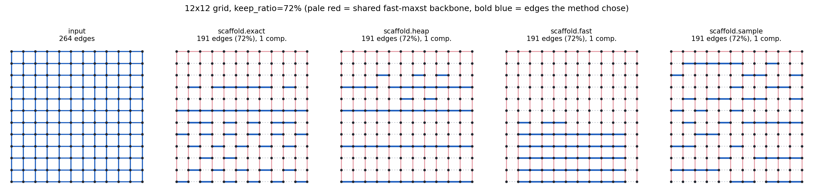
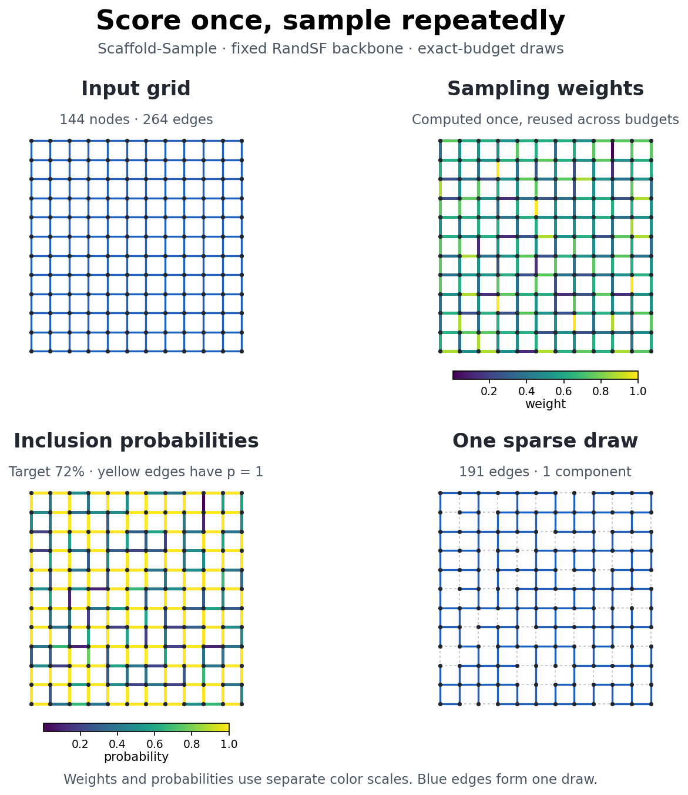
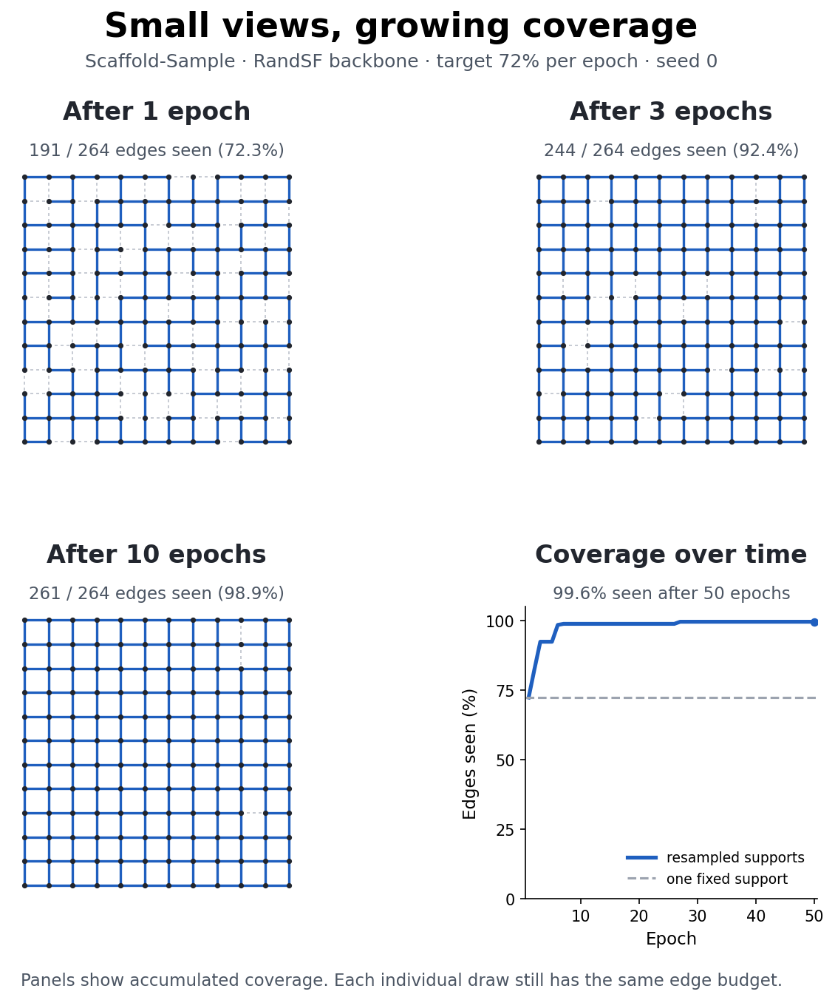
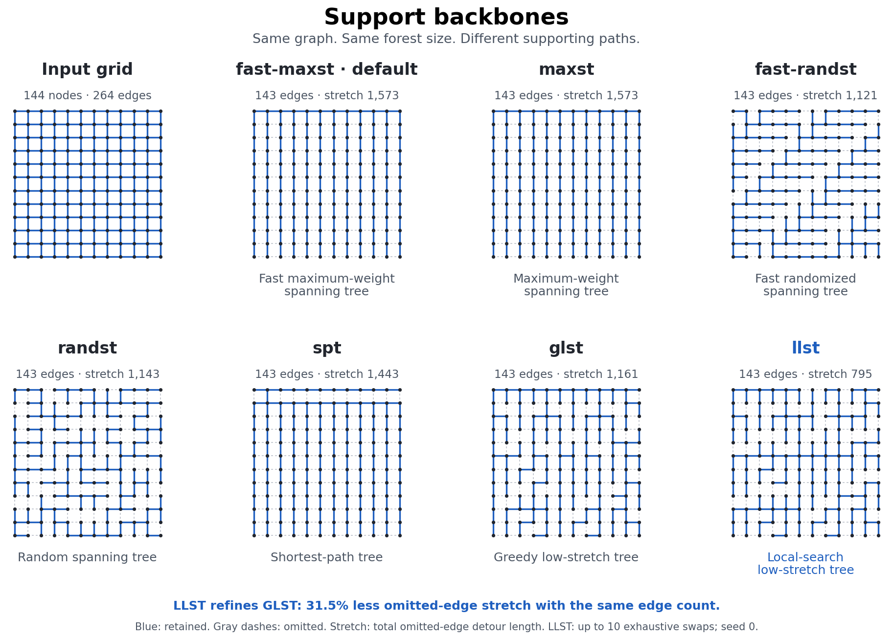

# SCAFFOLD

**Dilation- and congestion-aware graph sparsification.**

Most graph sparsifiers decide which edges to *delete*. SCAFFOLD works the other
way round: it starts from a spanning forest — so, whenever the budget can hold
that forest, the output has the input's connected components by construction —
and then spends the remaining edge budget on the edges whose absence hurts
most, measured by how far apart their endpoints end up and how much traffic the
detour forces through the surviving structure.

```bash
# current private-testing install (requires access to the private repository)
pip install "scaffold-sparse @ git+ssh://git@github.com/siddhartha047/Scaffold.git"

# after the public PyPI release
pip install scaffold-sparse
```

```python
import scaffold

result = scaffold.fast(G, keep_ratio=0.6)   # 60% of the undirected edges
print(result.summary())
# scaffold.fast: 5,278 -> 3,167 undirected edges (60.0% kept, 2,708 nodes)

sparse = result.to_pyg()          # or .to_networkx(), .to_scipy(), .to_torch()
```

`G` can be a NetworkX graph, a PyTorch Geometric `Data`, a `scipy.sparse`
matrix, or a plain `(2, m)` `edge_index` array.

---

## The five algorithms

All five take the same arguments and (except `sample`) return the same object,
so comparing them is a one-word change.

| | what it does | cost | use it when |
|---|---|---|---|
| `scaffold.greedy` | Reference greedy. Rescores every candidate after every insertion. | `O(M·m·(n+m))` | Validating; small graphs; you want the ground truth. |
| `scaffold.heap` | Lazy greedy. Stale scores in a heap; rescores only what an insertion actually changed. | ~`O(M·k·(n+m))` | Mid-sized graphs where you want to stay close to Greedy. |
| `scaffold.batch` | Samples a candidate batch, computes dilation and congestion within it, then adds the batch's top edges. | `O(ceil(A/r) [m + s(n+h) + s log s])` unweighted; definitions below | The original sampled-growth behavior; spatial spread with current-support rescoring. |
| **`scaffold.fast`** | **Scores every candidate exactly in one tree-prefix pass. No path search anywhere.** | **`O(m log n + n)`** | **Default. Real graphs.** |
| `scaffold.sample` | Returns per-edge *weights*, not a subgraph. Draw a fresh graph every epoch. | precompute once, then `O(m)` per draw | GNN training with per-epoch resparsification. |

For the Batch bound, `s = sample_size`, `r = add_per_round`, `A` is the
number of edges added after the backbone, and `h` is the number of edges in
the current support graph (`h <= m`). Assuming a full batch contributes `r`
edges, Batch evaluates about `ceil(A/r)` batches. Each unweighted batch scans
its candidate pool in `O(m)`, runs at most `s` BFS searches in `O(s(n+h))`,
and ranks the sample in `O(s log s)`. Thus the simpler worst-case bound is
`O(ceil(A/r) s(n+m))`. For weighted paths, replace the BFS term with
`O(s(n+h) log n)` for Dijkstra. Candidates sharing a source reuse one search,
so the observed cost can be lower.

```python
result = scaffold.greedy(G, keep_ratio=0.2)
result = scaffold.heap(G,   keep_ratio=0.2)
result = scaffold.batch(G,  keep_ratio=0.2)
result = scaffold.fast(G,   keep_ratio=0.2)
scores = scaffold.sample(G)

# or by name
result = scaffold.sparsify(G, method="fast", keep_ratio=0.2)
```

### What makes `fast` fast

While the support graph is still the backbone forest, every term of the
objective is a path aggregate on a *tree* — and every path aggregate on a tree
is a difference of two root-prefix sums. So instead of one shortest-path search
per candidate edge, the entire candidate set is scored together:

1. root the forest, build a binary-lifting ancestor table;
2. LCA of every candidate's endpoints;
3. edge and node congestion for **all** paths at once (+1 at both endpoints,
   −2 at the LCA, fold subtrees upward);
4. root-prefix sums, making every path aggregate an `O(1)` difference.

The scores are *identical* to what `scaffold.greedy` computes in its first round.
That equivalence is enforced by the test suite, not asserted in prose — see
[`tests/test_scoring.py`](https://github.com/siddhartha047/Scaffold/blob/main/tests/test_scoring.py).

Because the score is static during growth, the whole selection reduces to one
top-k.

The trade that buys: on a random geometric graph (600 nodes, 2,932 edges),
`greedy` takes 9,235 ms and `fast` 0.8 ms — 11,000× — for a mean dilation of
2.68 against Greedy's 2.40. Where `fast` does pay is *congestion*: a static
score cannot see the edges already added, so it concentrates its picks.
`scaffold.batch` and `scaffold.sample` spread them out.
[`docs/algorithms.md`](https://github.com/siddhartha047/Scaffold/blob/main/docs/algorithms.md) has the measured numbers across four
graph families, including the case where `fast` looks bad.

---

## See it work

A 12×12 lattice has no communities, no hubs and no important edges — every edge
is equivalent by symmetry. So whatever survives sparsification is the
*algorithm's* preference, not the graph's structure.

```bash
python examples/01_grid_demo.py --out docs/images
```

**The five methods at the same budget.** Pale red is a shared seeded `randst`
backbone (free — it is what guarantees connectivity); bold blue is what each
method chose to buy with the rest of the budget.



**`scaffold.sample` returns weights, not a subgraph.** Left: the
ratio-independent weight `π` for every edge. Middle: inclusion probabilities at
a 72% budget — yellow edges have `p = 1` and appear in *every* draw. Right: one
draw.



**Why that matters for training.** Any single sparsifier shows the model 72% of
the graph and permanently discards the rest. Redrawing each epoch shows it
nearly all of the graph, while every individual view stays small.



**Support backbones.** Every run starts from a spanning forest; which one
changes the character of the result. The randomized panels show the new
allocation-free `fast-randst` beside the fully shuffled `randst`.



---

## Standalone usage

The core needs only NumPy and SciPy. No PyTorch anywhere.

```python
import networkx as nx
import scaffold

G = nx.karate_club_graph()
result = scaffold.fast(G, keep_ratio=0.5, seed=0)

# Original sampled-batch growth instead of one-pass Fast:
batch_result = scaffold.batch(
    G, keep_ratio=0.5, sample_size=64, add_per_round=8, seed=0
)

H = result.to_networkx()          # original node labels preserved
print(nx.is_connected(H))         # True

result.mask                       # bool array over G's canonical edges
result.edge_ids                   # indices of the kept edges
result.edge_index                 # (2, 2k) symmetric numpy array
result.metadata                   # runtime, backbone, delta_min, ...
```

Choose either a ratio (with either spelling) or an explicit edge count:

```python
scaffold.fast(G, keep_ratio=0.1)      # ceil(0.1 * m) edges
scaffold.fast(G, target_ratio=0.1)    # equivalent research-config spelling
scaffold.fast(G, num_edges=1_000_000) # exactly this many
```

SciPy and raw arrays work the same way:

```python
import scipy.sparse as sp

A = sp.load_npz("adjacency.npz")
A_sparse = scaffold.fast(A, keep_ratio=0.2).to_scipy()

edge_index = np.load("edges.npy")             # (2, m)
result = scaffold.fast(edge_index, keep_ratio=0.2)
```

Full walkthrough: [`examples/02_standalone.py`](https://github.com/siddhartha047/Scaffold/blob/main/examples/02_standalone.py).

---

## PyTorch Geometric

```bash
pip install "scaffold-sparse[pyg]"
```

```python
from torch_geometric.datasets import Planetoid
import scaffold

data = Planetoid(root="/tmp/Cora", name="Cora")[0]

result = scaffold.fast(data, keep_ratio=0.6, seed=0)
sparse = result.to_pyg()          # x, y, train/val/test masks all preserved

print(data.num_edges, "->", sparse.num_edges)
```

As a dataset transform:

```python
from scaffold.pyg import ScaffoldTransform

dataset = Planetoid(
    root="/tmp/Cora", name="Cora",
    transform=ScaffoldTransform(method="fast", keep_ratio=0.6),
)
```

The same transform accepts Batch without any adapter changes:

```python
ScaffoldTransform(
    method="batch",
    keep_ratio=0.6,
    seed=0,
    sample_size=64,
    add_per_round=8,
)
```

Per-epoch resparsification — one precompute, a fresh view each epoch:

```python
from scaffold.pyg import ScaffoldResampler

resampler = ScaffoldResampler(data, keep_ratio=0.6, seed=0,
                              backbone="rotate-randst")

for epoch in range(500):
    view = resampler.epoch(epoch)      # a new Data, exact budget, exact components
    out = model(view.x, view.edge_index)
    ...
```

Or take the weights directly:

```python
scores = scaffold.sample(data, seed=0)
data.edge_index, data.edge_weight = scores.to_torch()
```

Full walkthrough with a trained GCN:
[`examples/03_pytorch_geometric.py`](https://github.com/siddhartha047/Scaffold/blob/main/examples/03_pytorch_geometric.py).

---

## Support backbones

The backbone is the spanning forest SCAFFOLD grows from, and it is what makes
the connectivity guarantee possible.

| name | description |
|---|---|
| **`fast-maxst`** | **Default.** Bucketed approximate maximum spanning forest — linear-time ordering instead of a comparison sort. |
| `fast-mst` | Same, minimizing. |
| `maxst` / `mst` | Exact stable Kruskal, `O(m log m)`. |
| `fast-randst` | Seeded coprime-stride random scan. No full permutation allocation; fastest randomized backbone. |
| `randst` | Kruskal on a full random permutation. Better mixing than `fast-randst`, but slower and uses an `O(m)` order array. |
| `spt` | Multi-source BFS forest. Low diameter. |
| `glst` | Greedy low-stretch tree. Best quality, `O(n·m·|cut|)` — small graphs only. |
| `none` | No backbone. Connectivity is then *not* guaranteed. |

```python
scaffold.fast(G, keep_ratio=0.2, backbone="fast-randst", seed=0)
scaffold.fast(G, keep_ratio=0.2, backbone=my_precomputed_mask)

scaffold.register_backbone("mine", my_builder)   # plug in your own
```

See [`docs/backbones.md`](https://github.com/siddhartha047/Scaffold/blob/main/docs/backbones.md) and
[`examples/04_backbones_and_tuning.py`](https://github.com/siddhartha047/Scaffold/blob/main/examples/04_backbones_and_tuning.py).

---

## The connectivity floor

A spanning forest of a graph with `n` nodes and `c` components has `n − c`
edges. Below `delta_min = (n − c) / m`, **no** sparsifier of any kind can keep
the components intact. SCAFFOLD does not pretend otherwise:

```python
result = scaffold.fast(G, keep_ratio=0.05)
result.metadata["delta_min"]                   # 0.3421
result.metadata["below_connectivity_floor"]    # True
result.num_components()                        # > 1, necessarily
```

In that below-floor case, all five variants first construct their complete
support forest and then randomly drop forest edges until the exact requested
budget is reached. Pass `seed=` to make that trim reproducible. This avoids
favoring the prefix of a backbone's deterministic edge order. Each
`sample.draw()` re-trims the forest, so per-epoch views still change.

Above the floor, every variant — including every `sample` draw — returns
exactly the input's component count. Not in expectation; with probability 1.

---

## Tuning the objective

```python
scaffold.fast(G, keep_ratio=0.2,
              alpha=1.0,        # dilation exponent
              beta_edge=1.0,    # edge-congestion exponent
              beta_node=1.0,    # node-congestion exponent
              edge_norm_p=2.0,  # p-norm along the path's edges
              node_norm_q=2.0)  # q-norm along the path's interior nodes
```

`score(e) = (dil/D_max)^alpha · (eConPath/E_max)^beta_edge · (vConPath/V_max)^beta_node`

`alpha` rewards candidates with a long detour; the betas reward candidates whose
detour runs through an already-overloaded part of the support, on the grounds
that adding them relieves a bottleneck. Setting both betas to `0` disables the
congestion terms and is noticeably faster.

Details in [`docs/algorithms.md`](https://github.com/siddhartha047/Scaffold/blob/main/docs/algorithms.md).

---

## Parallelism

Every variant takes a `workers` argument. It is a pure speed knob: the selected
edges are **bit-for-bit identical at any worker count**, so you can tune it
without invalidating a comparison.

```python
scaffold.fast(G, keep_ratio=0.2)              # auto: min(8, cpus)
scaffold.fast(G, keep_ratio=0.2, workers=4)   # explicit
scaffold.fast(G, keep_ratio=0.2, workers=1)   # serial
scaffold.fast(G, keep_ratio=0.2, workers="all")  # every core in the affinity mask
```

With `workers` unset the count is resolved from `SCAFFOLD_NUM_WORKERS`, then
`OMP_NUM_THREADS`, then `min(8, len(os.sched_getaffinity(0)))`. The default is
capped rather than taking the whole machine, because several unthrottled jobs
on one node slow each other down badly; to run a batch, cap them together:

```bash
OMP_NUM_THREADS=4 python train.py &   # four jobs, four threads each
```

What actually runs in parallel, measured on 8 threads:

| | parallel over | speed-up |
|---|---|---|
| `fast`, `sample` | candidates within one scoring pass | ~3x |
| `sample` precompute | that, plus the `tree_count` backbones | ~2.8x |
| `greedy`, `heap`, `batch` | candidate source groups in the path scorer | 2.5-3.4x end to end |

The path-based variants gained much more than threading alone would give: their
inner loop was rewritten as compiled kernels first. On a weighted graph, where
the old scorer ran Python's `heapq` Dijkstra, scoring is ~40x faster at 8
threads; unweighted, ~8x.

Small graphs fall back to serial automatically -- below a few hundred
candidates the thread dispatch costs more than the work.

Numba is required for any of this. Without it the kernels still run, as plain
Python loops, and `workers` has no effect.

---

## Installation

During private testing, install from the private GitHub repository:

```bash
pip install "scaffold-sparse @ git+ssh://git@github.com/siddhartha047/Scaffold.git"
```

After the public PyPI release, the shorter commands below become available.

```bash
pip install scaffold-sparse              # core: numpy + scipy
pip install "scaffold-sparse[speed]"     # + numba (10-50x on large graphs)
pip install "scaffold-sparse[networkx]"  # + networkx
pip install "scaffold-sparse[pyg]"       # + torch, torch-geometric
pip install "scaffold-sparse[viz]"       # + matplotlib, for the demos
pip install "scaffold-sparse[all]"       # everything except torch
```

Requires Python 3.9+. The distribution is `scaffold-sparse`; the canonical
import name is `scaffold` (`import scaffold_sparse` is also supported).

> **numba is optional but strongly recommended.** Without it the union-find,
> LCA and prefix-sum kernels fall back to pure Python loops — correct, but only
> fast enough for small graphs. The first call in a process pays a one-off JIT
> compilation cost of a few hundred milliseconds.

### Development install

```bash
git clone https://github.com/siddhartha047/Scaffold.git
cd Scaffold
pip install -e ".[dev]"
pytest
```

---

## Documentation

| | |
|---|---|
| [`docs/algorithms.md`](https://github.com/siddhartha047/Scaffold/blob/main/docs/algorithms.md) | The objective, and how each variant evaluates it |
| [`docs/api.md`](https://github.com/siddhartha047/Scaffold/blob/main/docs/api.md) | Complete API reference |
| [`docs/backbones.md`](https://github.com/siddhartha047/Scaffold/blob/main/docs/backbones.md) | Choosing and writing support backbones |
| [`docs/pytorch-geometric.md`](https://github.com/siddhartha047/Scaffold/blob/main/docs/pytorch-geometric.md) | GNN integration in depth |
| [`docs/validation.md`](https://github.com/siddhartha047/Scaffold/blob/main/docs/validation.md) | Real Cora parity with the research implementation |
| [`examples/`](https://github.com/siddhartha047/Scaffold/tree/main/examples) | Four runnable walkthroughs |

## Citing

If you use SCAFFOLD in academic work, please cite the paper. A BibTeX entry
will be added here on publication.

## License

BSD 3-Clause. See [LICENSE](https://github.com/siddhartha047/Scaffold/blob/main/LICENSE).
