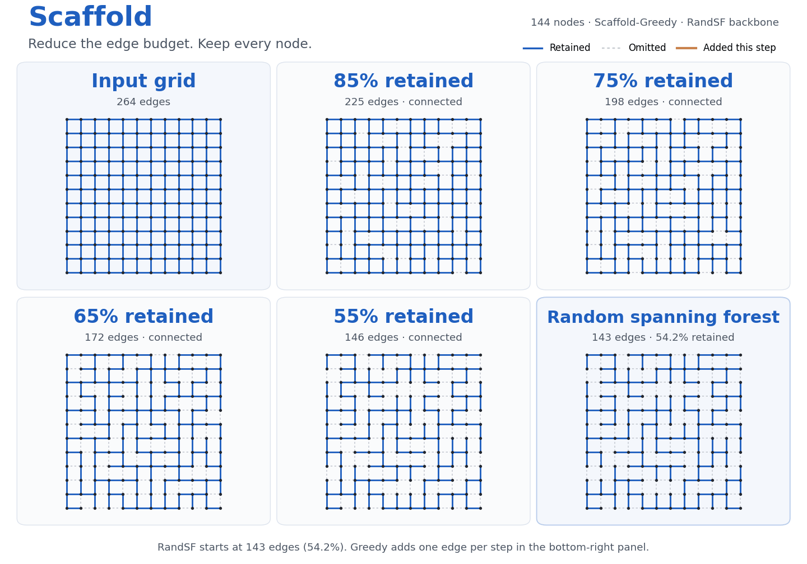
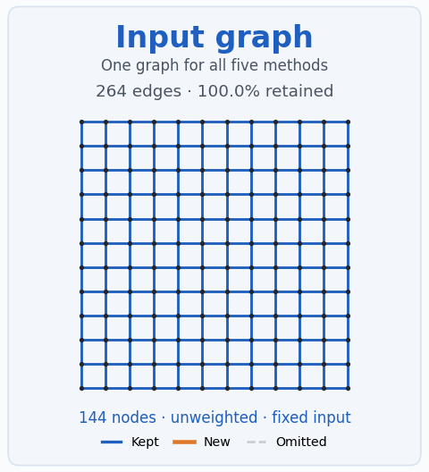
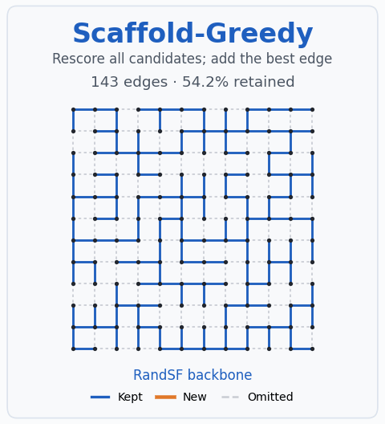
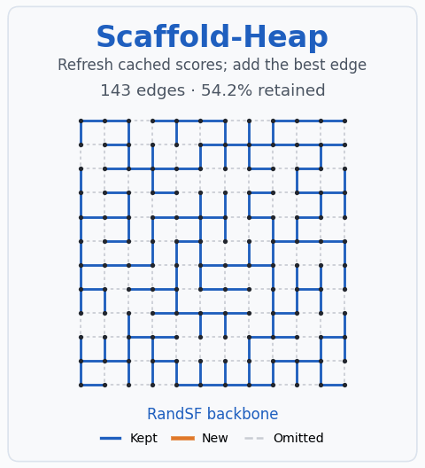
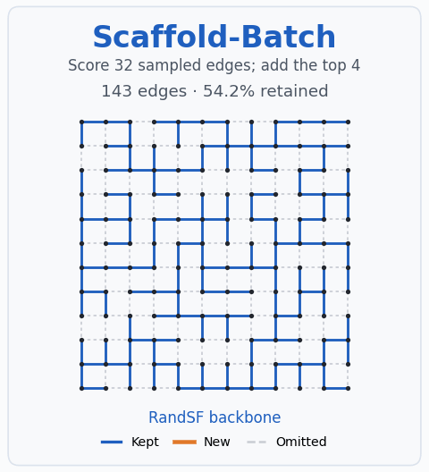
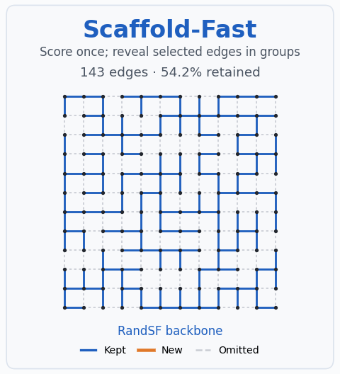
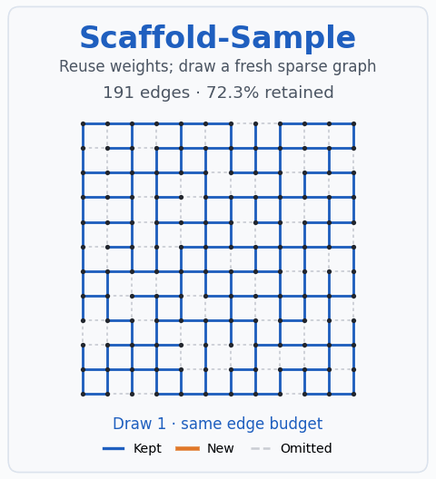

# Scaffold

**Reduce the edge budget. Keep every node.**



Scaffold sparsifies undirected graphs using **dilation and congestion**: start with a
spanning forest, then add edges whose endpoints need better supporting paths.
The demo above shows Greedy growing from RandSF (**143 edges, 54.2%**) to the
full graph; orange marks each new edge.

[Install](#installation) · [Quick start](#quick-start) ·
[Runtime](#runtime-expectations) · [Integrations](#use-with-your-existing-code) ·
[Backbones](#support-backbones) · [Demos](#visual-demos) · [Docs](#documentation)

## Installation

Install from GitHub; SSH access is required while the repository is private:

```bash
pip install "scaffold-sparse[speed] @ git+ssh://git@github.com/siddhartha047/Scaffold.git"
```

Python **3.9+**. The package is installed as `scaffold-sparse` and imported as
`scaffold`. Core dependencies are NumPy and SciPy; `[speed]` adds Numba and is
recommended for medium/large graphs. Add `networkx`, `pyg`, or `viz` to the
extras as needed, for example `[speed,pyg]`. After the public PyPI release,
use `pip install "scaffold-sparse[speed]"`.

## Quick start

**Recommended starting configuration: Scaffold-Fast + Fast-RandSF.**
`fast-randsf` and the older `fast-randst` name are equivalent.

```python
import scaffold

G = scaffold.grid_graph(12, 12)  # replace with your graph
result = scaffold.fast(
    G, keep_ratio=0.6, backbone="fast-randsf", seed=0, workers=8,
)
print(result.summary())
A_sparse = result.to_scipy()
```

`keep_ratio` retains exactly `ceil(keep_ratio * m)` unique undirected edges.
Use `num_edges=` for an explicit budget, or `target_ratio=` as an alias for
`keep_ratio`. Set `seed` for reproducibility. `workers` controls CPU
parallelism with Numba; if omitted, it uses environment settings or up to
8 available CPUs. The first call may include JIT compilation.

**Connectivity:** with a forest backbone, all input components are preserved
when the budget is at least `n − c` edges (`c` is the input component count).
Below this floor, Scaffold trims the forest to meet the budget; all nodes
remain, but components may split. Check `result.metadata["delta_min"]`.

## Runtime expectations

**20% edge retention · 8 CPU workers · synthetic unweighted graphs.**
Edge counts below are unique undirected edges.

| Method / setting | Nodes | Edges | Measured time |
|---|---:|---:|---:|
| Greedy | 400 | 3,131 | **0.75 s** |
| Heap, product score | 4,000 | 39,893 | **28.65 s** |
| Batch, 512 candidates / 64 insertions per cluster | 10,000 | 250,000 | **32.64 s** |
| Batch, 512 / 256 per cluster | 10,000 | 100,000 | **1.58 s** |
| Batch, 512 / 256 per cluster | 200,000 | 2,399,834 | **3,444.83 s (57.4 min)** |
| **Fast** | **200,000** | **2,399,834** | **0.73 s** |
| Sample, 8 scoring backbones | 200,000 | 2,399,834 | **5.01 s** preprocessing |
| Sample, cached draw | 200,000 | 2,399,834 | **0.048 s** per draw |

Measured on a shared AMD EPYC 7282 host with warmed Numba kernels. Construction
timings include the backbone and output assembly. All timings exclude input
loading, normalization, JIT startup, and GNN training. Values are medians except the
large Batch case (one completed run); Batch uses ten candidate clusters.
The construction benchmarks used **Fast-MaxSF**; Sample used fixed MaxSF
with eight randomized scoring forests. These recorded settings differ from
the recommended Fast-RandSF example above.

Use **Fast for one support** and **Sample for repeated draws** at large scale.
Batch repeatedly searches the evolving support, so its cost can be much
higher. Different graph sizes are shown; these are not same-input speed
comparisons. [Full settings, raw measurements, memory guidance, and 1M-node
planning estimates](docs/performance.md).

## Choose an algorithm

| Method | Selection | Use |
|---|---|---|
| `scaffold.greedy` | Recompute all scores after each insertion. | Small graphs; reference. |
| `scaffold.heap` | Cache scores; refresh affected candidates. | Small graphs. |
| `scaffold.batch` | Score candidate batches; insert their top edges. | Medium/large; dynamic refinement. |
| **`scaffold.fast`** | **Score once on the backbone; retain the top edges.** | **Large graphs; recommended start.** |
| `scaffold.sample` | Precompute weights; draw budgeted supports. | Medium/large; repeated sampling. |

Greedy, Heap, Batch, and Fast share the quick-start arguments. You can also
select by name: `scaffold.sparsify(G, method="fast", ...)`.
Sample returns reusable weights:

```python
scores = scaffold.sample(G, backbone="fixed-randsf", seed=0, workers=8)
view = scores.draw(keep_ratio=0.6, seed=1)  # repeat with another seed
```

<details>
<summary>Batch settings and objective tuning</summary>

```python
result = scaffold.batch(
    G, keep_ratio=0.6, backbone="fast-randsf", seed=0, workers=8,
    sample_size=512, add_per_round=64, clusters=10, cluster_method="bfs",
)

result = scaffold.fast(
    G, keep_ratio=0.6, backbone="fast-randsf", seed=0,
    alpha=1.0, beta_edge=1.0, beta_node=0.0,
    edge_norm_p=2.0, node_norm_q=2.0,
)
```

Batch defaults to 64 candidates / 8 insertions below 1,024 input edges and
256 / 64 otherwise. Larger insertion batches reduce rescoring but can affect
quality. `alpha`, `beta_edge`, and `beta_node` weight dilation, edge congestion,
and node congestion; zero disables a term. [Algorithm guide](docs/algorithms.md).

</details>

### Watch each method

All five use the **same seeded RandSF backbone** and a **191-edge budget**.
Greedy, Heap, and Batch show real insertion rounds. Fast reveals its one-pass
selection in groups; Sample draws different supports at the same budget.
Orange marks new edges. Animation timing is illustrative.

<table>
  <tr>
    <td><a href="docs/images/variants/input.png"></a></td>
    <td><a href="docs/images/variants/greedy.gif"></a></td>
    <td><a href="docs/images/variants/heap.gif"></a></td>
  </tr>
  <tr>
    <td><a href="docs/images/variants/batch.gif"></a></td>
    <td><a href="docs/images/variants/fast.gif"></a></td>
    <td><a href="docs/images/variants/sample.gif"></a></td>
  </tr>
</table>

[Combined GIF](docs/images/variants/variants.gif) ·
[Reproduce these animations](examples/README.md#variant-animations).

## Use with your existing code

Scaffold accepts **NetworkX graphs, SciPy sparse matrices, NumPy/Torch edge
indices, and PyG `Data`**. Sparsification runs on CPU; convert the result to
the format your downstream code uses.

### NetworkX and SciPy

```python
import networkx as nx
import scipy.sparse as sp
import scaffold

options = dict(keep_ratio=0.6, backbone="fast-randsf", seed=0, workers=8)

G = nx.karate_club_graph()
H = scaffold.fast(G, **options).to_networkx()  # original node labels preserved

A = sp.load_npz("adjacency.npz")
A_sparse = scaffold.fast(A, **options).to_scipy()
sp.save_npz("adjacency_sparse.npz", A_sparse)
```

For raw `(2, m)` edge indices, use
`G = scaffold.normalize_graph(edge_index, num_nodes=n)` before the same call;
passing the node count preserves isolated nodes. Results expose `.edge_index`
(both directions), `.edge_weight`, `.to_torch()`, and `.mask` over normalized
canonical edges. [Standalone examples](examples/02_standalone.py).

### PyTorch Geometric

With the `pyg` extra installed, use your existing `data` object:

```python
import scaffold

sparse = scaffold.fast(
    data, keep_ratio=0.6, backbone="fast-randsf", seed=0, workers=8,
).to_pyg()  # preserves node features, labels, and split masks
sparse = sparse.to(device)
out = model(sparse.x, sparse.edge_index)
```

For a dataset transform or fresh supports each training epoch:

```python
from scaffold.pyg import ScaffoldTransform, ScaffoldResampler

transform = ScaffoldTransform(
    method="fast", keep_ratio=0.6, backbone="fast-randsf", seed=0, workers=8,
)  # pass as your dataset's transform= argument

resampler = ScaffoldResampler(
    data, keep_ratio=0.6, backbone="rotate-randsf", seed=0, workers=8,
)  # Sample preprocessing happens once
for epoch in range(100):
    view = resampler.epoch(epoch).to(device)
    out = model(view.x, view.edge_index)
    # Compute your loss, backpropagate, and update the optimizer.
```

[Complete GCN training example](examples/03_pytorch_geometric.py) ·
[PyG integration guide](docs/pytorch-geometric.md).

## Support backbones

A backbone is a **spanning forest**: one tree per input component, including
isolated nodes. On a connected graph it is a single tree; the final support
may contain cycles. Forest names and legacy tree names are interchangeable.

| API name | Meaning | Guidance |
|---|---|---|
| **`fast-randsf` (`fast-randst`)** | **Fast randomized spanning forest** | **Recommended start; seeded strided Kruskal.** |
| `randsf` (`randst`) | Random spanning forest | Shuffled Kruskal. |
| `fast-maxsf` / `fast-minsf` | Fast maximum/minimum-weight spanning forest | Bucketed Kruskal; `fast-maxsf` is the API's fallback when no backbone is passed. |
| `maxsf` / `minsf` | Maximum/minimum-weight spanning forest | Exact sorted Kruskal. |
| `spf` (`spt`) | Shortest-path forest | Degree-rooted BFS; hop distance. |
| `randspf` (`randspt`) | Random shortest-path forest | Random roots; BFS/Dijkstra. |
| `slsf` (`slst`) | Scalable low-stretch forest | **Slow**; compares multiple rooted forests. |
| `glsf` (`glst`) | Greedy low-stretch forest | **Slow**; small graphs only. |
| `llsf` (`llst`) | Local-search low-stretch forest | **Slow**; limited to 1,000 input edges by default. |
| `none` | No backbone | No connectivity guarantee. |

RandSPF, SLSF, GLSF, and LLSF require the `networkx` extra. Randomized Kruskal
is not a uniform spanning-tree sampler. On unweighted inputs, minimum- and
maximum-weight variants coincide under the implementation's tie ordering.
Use `scaffold.available_backbones(notation="forest")` to list names; custom
backbones can be passed as masks or registered with `scaffold.register_backbone`.
[Aliases, options, and custom builders](docs/backbones.md) ·
[LLSF usage](examples/05_local_search_backbone.py).

## Visual demos

Unweighted **12×12 grid: 144 nodes, 264 edges**, seed 0. These connected-grid
examples use RandSF for the method and sampling comparisons.

### Resample a sparse view each epoch

Each view retains **191 edges** and stays connected. The union reaches
**263/264 edges (99.6%)** after 50 epochs. The panels show input, current
view, cumulative union, and coverage.

<p align="center">
  <a href="docs/images/grid_coverage.gif">
    
  </a>
</p>

<details>
<summary>Compare support backbones</summary>

Backbone panels expand each name; all retain 143 edges. Blue edges are
retained and gray dashes are omitted.


<p align="center">
  <a href="docs/images/grid_backbones.gif">
    
  </a>
</p>

</details>

Reproduce from a checkout:

```bash
pip install -e ".[viz,speed]"
python examples/01_grid_demo.py --out docs/images
python examples/06_variant_animations.py --out docs/images/variants
# Script 01 accepts --only coverage / --only backbones; both accept --quick.
```

[All demos, settings, and recorded measurements](examples/README.md).

## Documentation

[API reference](docs/api.md) · [Algorithms and scoring](docs/algorithms.md) ·
[Runtime and memory](docs/performance.md) · [Backbones](docs/backbones.md) ·
[PyG integration](docs/pytorch-geometric.md) · [Runnable examples](examples/) ·
[Validation](docs/validation.md) · [Contributing](CONTRIBUTING.md).

**License:** [BSD 3-Clause](LICENSE). **Citation:** a BibTeX entry will be added
when the paper is published.
